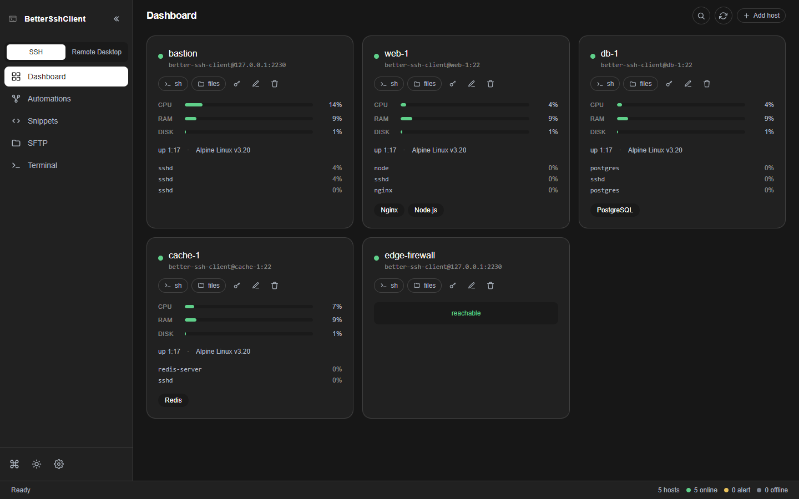
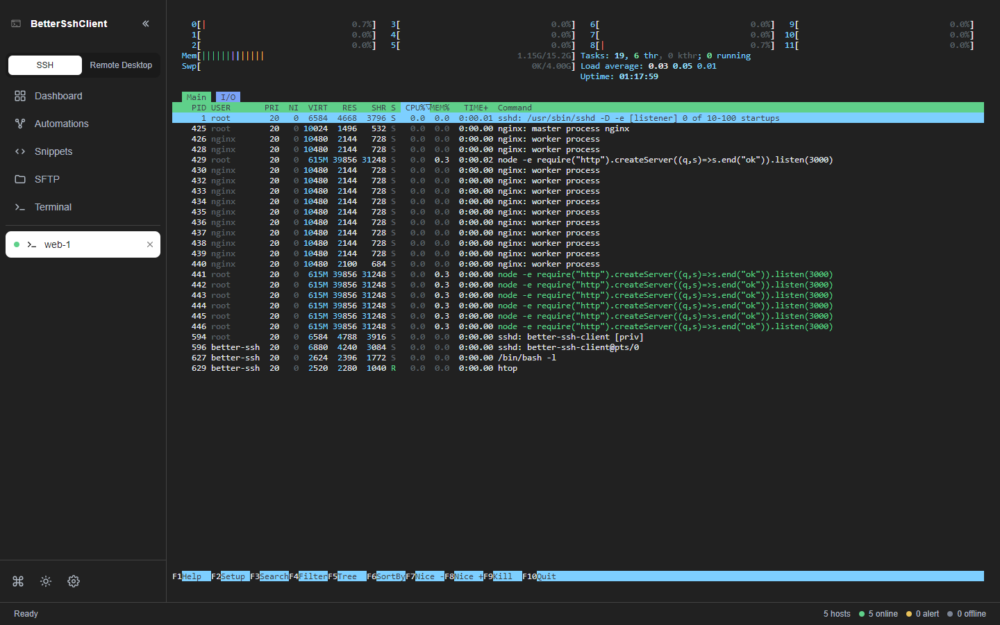
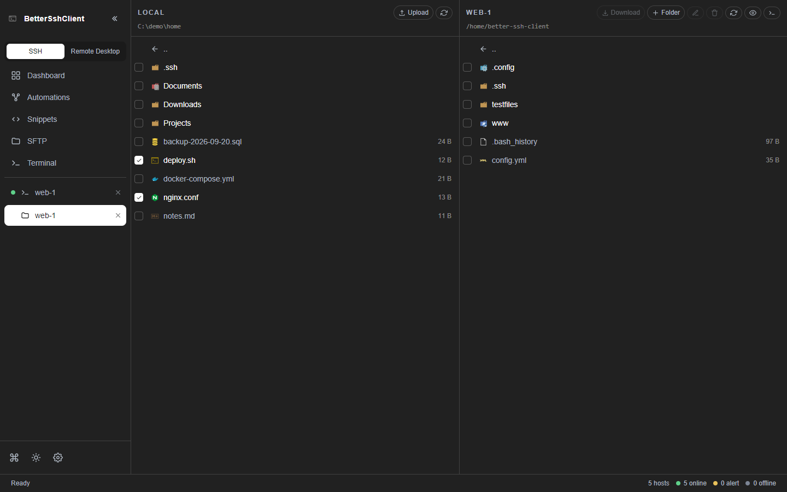
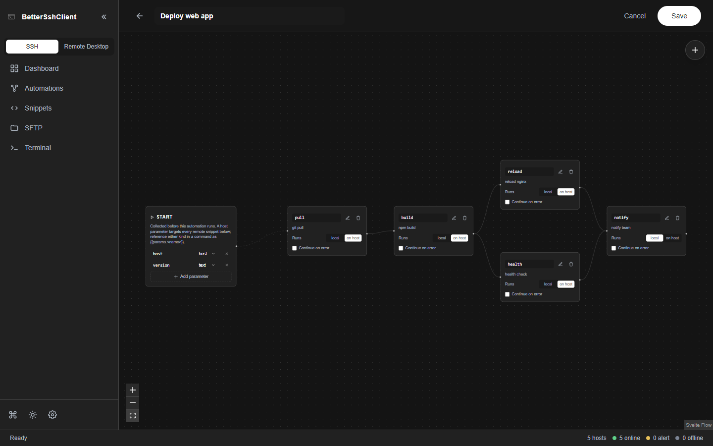
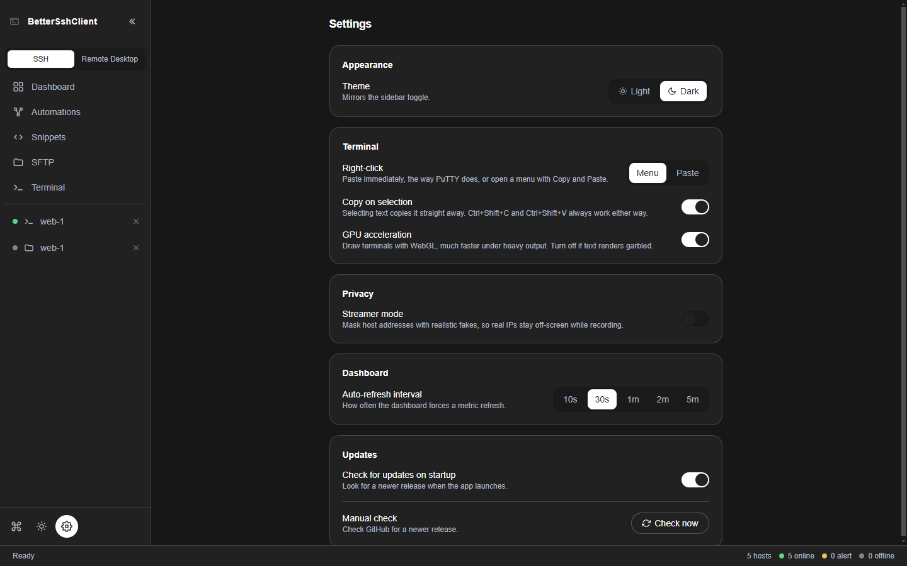

<div align="center">

# Better Ssh Client

**An SSH client built around my daily workflow: dashboard, terminals, SFTP and automations in one window.**



[](https://github.com/Sniphs98/better-ssh-client/releases/latest)
[](https://github.com/Sniphs98/better-ssh-client/actions/workflows/release.yml)
[](LICENSE)

**[Why this exists](#why-this-exists)** •
**[Features](#features)** •
**[Screenshots](#screenshots)** •
**[Install](#install)** •
**[Feedback](#feedback-and-contributing)** •
**[Development](#development)**

</div>

---

## Why this exists

I built this SSH client for myself, to support my workflow at work. It's based on
[**OmnySSH**](https://github.com/timhartmann7/omnyssh) by
[Tim Hartmann](https://github.com/timhartmann7).

I don't follow the idea that everything has to be as tiny and lightweight as possible.
For me this is a tool, and it should simply work. If it needs a few hundred MB more RAM
for that, that's fine by me. So I did exactly what goes against OmnySSH's core idea: I had
it rebuilt in **Electron** by [Claude](https://claude.com/claude-code), in plain
**TypeScript** with **SvelteKit** for everything.

The tool isn't finished yet, but it already has a few new features. See the list below
for what works, what's in progress, and what's still planned.

---

## Features

| | Feature | What it does |
|:-:|---|---|
| ✅ | **Live dashboard** | A card per server with CPU, RAM, disk, uptime, OS and top processes. Detects running services (Docker, nginx, Node.js, PostgreSQL, Redis). Appliances without a shell can be watched with a plain TCP port check. |
| ✅ | **Terminals** | Real PTY sessions in tabs, GPU-rendered with xterm.js. Copy on select, `Ctrl+Shift+C`/`V`, configurable right-click (menu or PuTTY-style paste). |
| ✅ | **Two-panel SFTP** | Local and remote side by side, drag & drop (also from your file manager), parallel transfers, smooth even in folders with thousands of files. |
| ✅ | **In-place file editor** | Double-click a text file to edit it with Monaco, the editor from VS Code, local or remote. |
| ✅ | **One-click SSH key setup** | Generates an Ed25519 key, installs it, verifies it, and optionally turns off password login, with automatic rollback if anything fails. |
| ✅ | **ProxyJump** | Hosts behind one or more bastions work everywhere: dashboard, terminal, SFTP. |
| ✅ | **Shared connections** | Dashboard, terminals and SFTP share one connection per host, so a new tab opens instantly. |
| ✅ | **Encrypted passwords** | Stored passwords are encrypted with the OS keystore (DPAPI, Keychain, libsecret). |
| ✅ | **Command palette** | `Ctrl+K` / `⌘K` finds any host or open session. |
| ✅ | **Streamer mode** | Replaces every real address on screen with a fake one for demos and screen sharing. |
| ✅ | **Light & dark theme** | |
| 🚧 | **Snippets & automations** *(in progress)* | Save commands as snippets and chain them into automations on a canvas, run locally or on a host, with parameters and the output of earlier steps. Usable, but still changing. |
| 📋 | **Remote desktop (RDP)** *(to do)* | RDP profiles next to your SSH hosts, launched through the OS's own client. Not ready yet. |

✅ done · 🚧 in progress · 📋 planned

---

## Screenshots

| Terminal | SFTP |
|:-:|:-:|
|  |  |
| **Automations** | **Settings** |
|  |  |

---

## Install

Download the file for your system from the [**latest release**](https://github.com/Sniphs98/better-ssh-client/releases/latest):

| System | File |
|---|---|
| **Windows** | `BetterSshClient-<version>-setup.exe` (installer) or `-portable.exe` (no install) |
| **macOS** | `BetterSshClient-<version>-mac-<arch>.dmg` |
| **Linux** | `.AppImage`, `.deb` or `.rpm` |

> [!NOTE]
> Since it's an Electron app, it should in theory run on every system, **but so far I've
> only tested it on Windows.** macOS and Linux builds are produced automatically but are
> untested. If something breaks there, please [open an issue](#feedback-and-contributing).

The builds aren't code-signed, so your OS asks once on first launch:

- **Windows:** SmartScreen shows "Windows protected your PC". Click *More info → Run anyway*.
- **macOS:** right-click the app → *Open* → *Open*.
- **Linux AppImage:** `chmod +x BetterSshClient-*.AppImage`, then run it.

The app reads the hosts from your `~/.ssh/config` (it never writes to it) and stores its
own data in `%APPDATA%\better-ssh-client\` (Windows), `~/Library/Application Support/better-ssh-client/`
(macOS) or `~/.config/better-ssh-client/` (Linux).

---

## Feedback and contributing

Found a bug or have an idea? **[Open an issue](https://github.com/Sniphs98/better-ssh-client/issues/new/choose)**
and describe it there. Feedback on macOS and Linux is especially welcome.

If you've fixed something yourself, feel free to open a **pull request**. I'll look at it
and merge it when I have time. [CONTRIBUTING.md](CONTRIBUTING.md) explains the setup and
conventions. For security issues, please see [SECURITY.md](SECURITY.md) instead of
opening a public issue.

---

## Development

You need **Node.js 22+** and npm. Docker is optional (for the integration tests).

```bash
git clone https://github.com/Sniphs98/better-ssh-client.git
cd better-ssh-client
npm ci
npm run dev:electron     # build and start the app
```

| Command | What it does |
|---|---|
| `npm run dev` | UI only, in the browser, for fast iteration on screens |
| `npm run check` | Type checks for both packages |
| `npm test` | Unit tests |
| `npm run test:e2e` | End-to-end UI tests (Playwright) |
| `npm run test:integration` | Tests against a real SSH server (`docker compose up -d --build` first) |
| `npm run package:dir` | An unpacked app for your system, in `release/` |

```
packages/electron   Electron main process: SSH/SFTP engine, config, IPC
packages/ui         SvelteKit UI: dashboard, terminal, SFTP, automations, settings
```

**Releases are automatic:** every merge to `main` runs all tests and, if it contains a
`feat`, `fix` or `perf` commit, publishes a new release for all platforms. The details
are in [CONTRIBUTING.md](CONTRIBUTING.md#8-releases).

---

## Credits

Built on [**OmnySSH**](https://github.com/timhartmann7/omnyssh) by
[Tim Hartmann](https://github.com/timhartmann7). The dashboard, the SSH and SFTP engine,
the key setup and the terminal all started as his work. Thanks for building it!

The SFTP file icons are from [vscode-icons](https://github.com/vscode-icons/vscode-icons)
(MIT, © Roberto Huertas).

## License

[Apache 2.0](LICENSE), like OmnySSH. Copyright in the original work remains with the
OmnySSH contributors.
